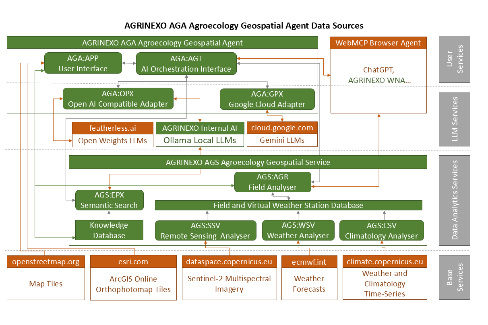

# AGRINEXO AGA - Agroecology Geospatial Agent

AGRINEXO AGA is an agroecology geospatial agent, built to support farmers and
technicians building more sustainable and resilient agroecosystems.

AGRINEXO AGA delivers the geospatial user interface, a standard chat pane, API
connectors and a set of AI orchestration interfaces that drive LLM reasoning,
tool usage and WebMCP communication.

The implemented API connectors allow AGRINEXO AGA to use: Open AI compatible LLMs;
Google Vertex AI compatible LLMs; and AGRINEXO AGS Agroecology Geospatial Service.

AGRINEXO AGS is an API service, that manages: fields, crops, satellite imagery,
farm records and a knowledge base with semantic search.

Source code of this 
[pre-release version developed for the MunichTech EXPO AI Challenge](https://devpost.com/software/agrinexo-aga) comprises:
- app (tenant-facing web UI); 
- agt (the agent layer);
- wmx (tool surface);
- opx (OpenAI-compatible model proxy); 
- gpx (Gemini model proxy); 
- www (public landing shells);
- libs (vendored raster JS libraries); 
- doc (end-user guide);
- wna (WebMCP nano-agent, a Google Chrome browser extension we ended up developing just to verify WebMCP with Open Weights LLMs).

## app — tenant-facing web UI

Tenant-facing web UI. Vue3/Quasar page shells for fields, crops, climate,
vegetation, water, weather, reports and the AI assistant, embedded per-tenant
via iframes keyed by `krd`.

PHP shells + Vue3/Quasar from CDN, no build step. JWT in localStorage, checked
by `auth-guard.php`. Tenant id passed as `window.parent.krd` across
same-origin iframes (no postMessage). `config.php` names the backend API base
URL.

## agt — the agent layer

The agent layer. Owns the tool-calling loop (`assistant.php`/`agent.php`/
`chat.php`), conversation history and tenant auth, dispatching to LLM
providers through the `opx`/`gpx` proxies.

Stateless PHP request loop. `tools.php`/`tools-extra.php` define and run tools
against `api/`. `config-ai-google-gemini.php` and
`config-ai-openai-compatible.php` map model → proxy + shared key.
`pukkey.php` handles the key handshake; `webmcp-ask.js` bridges browser-run
tools.

## wmx — tool surface

Tool surface published to the agent and browser. Defines each tool's schema
and executes it by calling `api/` on the caller's behalf — it runs no SQL
itself.

`tools.php` dispatches to `api/*` forwarding the caller's Authorization
header and `krd`. `tool-validators.php` validates arguments before dispatch.
`webmcp.js`/`aibridge.js` expose the same tools in-browser (WebMCP) for `wna`
to call.

## opx — OpenAI-compatible model proxy

OpenAI-compatible model proxy. Wire-format boundary between
`agt/assistant.php` and one Ollama server or hosted OpenAI-compatible
account, relocated across a network hop. Sibling of `gpx`, same contract for
Gemini.

Stateless PHP, no session/DB. Routed via `index.php` (`/generate`,
`/health`), no mod_rewrite needed. One instance = one endpoint/key, set in
`config.php`; shared key checked against
`agt/config-ai-openai-compatible.php` via `X-Agent-Token`. `.htaccess` needs
`AllowOverride All`.

## gpx — Gemini model proxy

Gemini model proxy (Cloud Run), sibling of `opx`. Accepts the
provider-agnostic message shape from `agt/assistant.php`, performs one Gemini
call, and returns it — including `thought_signature` handling opx has no
analogue for.

Python (`main.py`), containerised via `Dockerfile`, deployed with
`deploy.sh`. Stateless, one instance per Vertex project/key, same contract as
`opx` (`/generate`, `/health`).

## www — public landing shells

Public marketing/landing shells per language (EN/PT) that host the AGT
chat widget (`AGA-PT26-AGT-*.php`), plus PWA manifest and service worker.

Plain PHP includes (`msk-*.php` fragments), no framework. Per-locale
`config-*.php` selects copy/endpoints. `msk-sw*.js`/`msk-manifest*.php` add
offline caching.

## libs — vendored raster JS libraries

Vendored, unmodified browser JS libraries (`georaster`, `geoblaze`,
`georaster-layer-for-leaflet`) that `app/vegetation.php` loads to render
satellite raster layers on the Leaflet map.

No package manager, no build step — files copied as-is from upstream
releases and served as static assets. Update by dropping in a newer upstream
build, never by hand-editing these files.

## doc — end-user guide

The single end-user getting-started guide (`gettingstarted.txt`,
`gettingstarted-pt.txt`), fetched and rendered by `app/help.php` inside the
app's help panel.

Plain text/Markdown-ish, one file per locale, no processing beyond what
`help.php` applies to display it.

## wna — browser extension (WebMCP nano-agent)

Browser extension (Manifest V3) — a WebMCP nano-agent that drives any page
registering tools via an OpenAI-compatible model, through a side panel UI.

Static JS/HTML, no build step. `content.js` runs in every frame to discover
page-registered tools; `background.js`/`sidepanel.js` hold the chat loop;
`config.js` holds endpoint/key.
